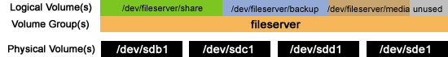

# Drives

## Physical Drives

A physical drive is the hardware that exists physically, this can be a Hard Disk Drive (HDD)
or a Solid State Drive (SSD). The data (0s and 1s) on a HDD are represented as peaks and 
troughs on its optical discs. Whereas an SSD stores its data as varying charge levels 
in memory cells.

## Partitions

Partitions are the subdivision of a drive. Operating systems will usually treat partitions 
as separate physical drives. 

### Partitioning Information

There are two ways to store partitioning information on drives, MBR and GPT. This information
includes where partitions start and end on the physical disk. This ensures the OS knows which
sectors belong to which partitions as well as what partitions are bootable. MBR is limited to
four primary partitions or three primary and one extended whereas GPT can have 128 partitions.

## Physical Volumes

Physical volumes are self-contained data units. They are assigned a unique name and configured 
with a single file system such as NTFS or FAT32. In most cases a volume will take up an 
entire drive or partition. On windows, C: or D: are physical volumes.

## Logical Volumes

Volume groups are created by combining physical volumes in which logical volumes are created 
on top. Logical volumes are not limited to one physical drive but instead the volume group
which can span mulitple drives and partitions. An example of this is RAID 1 which mirrors 
data across drives.

## Logical Drives

When mulitple partitions are made on a physical drive and formatted into volumes, each volume
is a logical drive.
