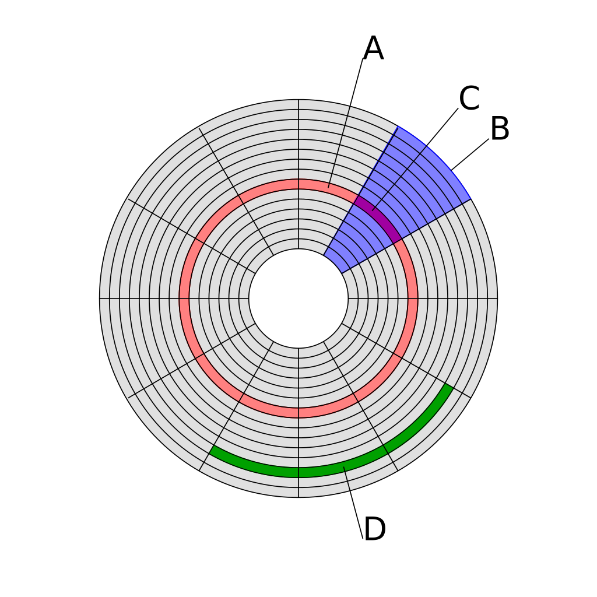

# Clusters, Sectors, and Tracks

| Label | Meaning |
|-------|---------|
|A|Track.|
|B|Sector.|
|C|Sector of track.|
|D|Cluster of sectors.|

# File Allocation Table (FAT) Boot Sector Layout
| Offset | Length (Bytes) | Meaning |
|--------|----------------|---------|
|0x00|3|Bootsrap jump command.|
|0x03|8|OEM name.|
|0x0b|2|Bytes per sector (big-endian).|
|0x0d|1|Sectors per cluster.|
|0x0e|2|Reserved sectors.|
|0x10|1|Number of FATs.|
|0x11|2|Number of root entries.|
|0x13|2|Number of sectors < 32 MB, 0 for FAT 32.|
|0x15|1|Media descriptor: f0 is removable, f8 is fixed.|
|0x16|2|Sectors per FAT.|
|0x18|2|Sectors per track.|
|0x1A|2|Number of heads.|
|0x1C|4|Number of hidden sectors.|
|0x20|4|Number of sectors > 32 MB.|

What comes after 0x20 depends on the type of FAT being 
used. FAT12 and FAT16 differs from FAT32.
### FAT12 and FAT16
| Offset | Length (Bytes) | Meaning |
|--------|----------------|---------|
|0x24|1|Drive number.|
|0x25|1|Windows NT flag.|
|0x26|1|Extended boot signature.|
|0x27|4|Volume serial number.|
|0x2b|11|Volume label.|
|0x36|8|File system type: FAT12 or FAT16.|

### FAT32
| Offset | Length (Bytes) | Meaning |
|--------|----------------|---------|
|0x24|4|32-bit count of sectors per FAT.|
|0x28|2|External flags.|
|0x2a|2|File system version.|
|0x2c|4|Root directory cluster.|
|0x30|2|File system info.|
|0x32|2|Boot record backup.|
|0x34|12|Reserved.|
|0x40|1|Number of drives.|
|0x41|1|Reserved.|
|0x42|1|Boot signature.|
|0x43|4|Volume ID.|
|0x47|11|Volume label.|
|0x52|8|File system type.|

# NTFS Boot Sector Layout
| Offset | Length (Bytes) | Meaning |
|--------|----------------|---------|
|0x00|3|Bootstrap jump command.|
|0x03|8|OEM ID.|
|0x0b|2|Bytes per sector.|
|0x0d|1|Sectors per cluster.|
|0x0e|2|Reserved sectors.|
|0x10|3|Reserved, this value is always 0.|
|0x13|2|Not used by NTFS.|
|0x15|1|Media descriptor.|
|0x16|2|Always 0.|
|0x18|2|Sectors per track.|
|0x1a|2|Number of heads.|
|0x1c|4|Hidden sectors.|
|0x20|4|Not used by NTFS.|
|0x24|4|Not used by NTFS.|
|0x28|8|Total sectors.|
|0x30|8|Logical cluster number for the file $MFT.|
|0x38|8|Logical cluster number for the file $MFTMirr.|
|0x40|4|Clusters per file record segment.|
|0x44|1|Clusters per index buffer.|
|0x45|3|Not used by NTFS.|
|0x48|8|Volume serial number.|
|0x50|4|Checksum.|
|0x54|426|Bootstrap code.|
