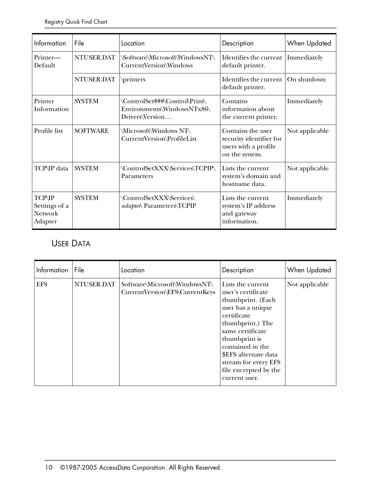

# Windows Registry Analysis

## What is the Registry?

The registry is a database of stored configuration information about
the users, hardware, and software on a Windows system.

Within the registry there are 5 main root folders also known as hives which
contain:

- HKEY_USERS: settings for all user profiles on system.
- HKEY_CURRENT_USER: settings specific to the currently logged-in user.
- HKEY_CLASSES_ROOT: manages file associations and COM objects, e.g. which application opens .txt files.
- HKEY_CURRENT_CONFIG: Tracks the current hardware profile.
- HKEY_LOCAL_MACHINE: configuration data for the local system.

Non-volatile hives include: HKLM, and HKU.

Volatile hives include: HKCR, HKCU, and HKCC.

Each hive listed above will contain various keys and subkeys which contain descriptions and values.
These values are often 0 or 1 indicating on or off, but can also contain more complex information
in some cases.

## Offline Analysis

Registry hives have supporting files that contain the respective registry data. These hives and their
supporting files are listed below:

- HKEY_CURRENT_CONFIG: SYSTEM
- HKEY_CURRENT_USER: NTUSER.DAT
- HKEY_USERS\\.DEFAULT: DEFAULT
- HKEY_LOCAL_MACHINE\SAM: SAM
- HKEY_LOCAL_MACHINE\SECURITY: SECURITY
- HKEY_LOCAL_MACHINE\SOFTWARE: SOFTWARE 
- HKEY_LOCAL_MACHINE\SYSTEM: SYSTEM

If we only have access to a disk image we need to know where these supporting files are located.
The supporting files: DEFAULT, SAM, SECURITY, SOFTWARE, and SYSTEM can be found within:

`C:\Windows\System32\config`

These files contain the following registry data:

- DEFAULT: default user settings.
- SAM (Security Account Manager): local user account and group membership information like passwords.
- SECURITY: information on the current user security policy.
- SOFTWARE: installed applications and their configuration settings.
- SYSTEM: configuration settings of hardware drivers and services.

NTUSER.DAT is instead found within:

`C:\Users\<user>\NTUSER.DAT`

This supporting file contains any user configurations where changes made are saved here during the
logout process.

## Registry Quick Find Chart

